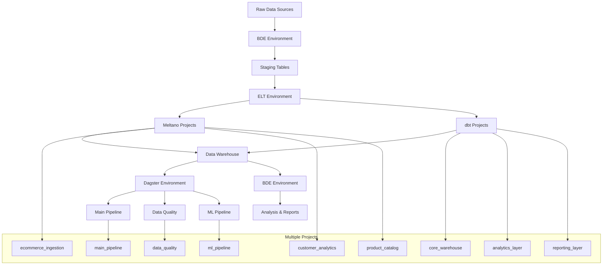

# DS2 BDE Team 1 - End-to-End Data Pipeline Project

[](https://www.python.org/)
[](https://en.wikipedia.org/wiki/SQL)
[](https://www.getdbt.com/)
[](https://greatexpectations.io/)

## Overview

This repository contains an **end-to-end data pipeline and analysis workflow** built for Module 2 Assignment. The project demonstrates comprehensive data engineering practices including data ingestion, warehouse design, ELT processes, data quality testing, and analytical insights using Python.

## 🏗️ Project Architecture

Our data pipeline follows a modular, scalable architecture that separates concerns and maintains clear data lineage:

```
Raw Data → Staging → Processed → Star Schema → Analysis & Insights
```

### Key Design Principles

- **Data Provenance**: Separate raw/staging/processed layers to maintain lineage and enable reprocessing
- **Portability**: SQL DDL designed to work across different SQL engines
- **Modularity**: Clear separation between ingestion and transformation logic
- **Quality First**: Comprehensive data quality checks integrated into the pipeline
- **Scalability**: Infrastructure-as-code approach for deployment automation

## 📁 Repository Structure

```
DS2_BDE_Tm1/
├── data/                          # Data storage (git-ignored for large files)
│   ├── raw/                       # Raw source data files
│   ├── staging/                   # Intermediate processed data
│   └── processed/                 # Final processed data (Parquet, DB dumps)
├── src/                           # Source code
│   ├── db/                        # Database components
│   │   └── ddl/                   # Data Definition Language scripts
│   │       ├── raw/               # Raw table schemas
│   │       └── star_schema/       # Star schema DDL
│   ├── ingestion/                 # Data ingestion scripts
│   │   ├── __init__.py
│   │   ├── extract.py             # Data extraction logic
│   │   ├── loaders/               # Database loaders
│   │   └── meltano_projects/      # Multiple Meltano ELT projects
│   │       ├── ecommerce_ingestion/    # E-commerce data ingestion
│   │       │   ├── meltano.yml         # Project-specific config
│   │       │   ├── extractors/         # Source connectors
│   │       │   ├── loaders/            # Target connectors
│   │       │   ├── schedules/          # Job schedules
│   │       │   └── plugins/            # Custom plugins
│   │       ├── customer_analytics/     # Customer data pipeline
│   │       │   ├── meltano.yml
│   │       │   ├── extractors/
│   │       │   ├── loaders/
│   │       │   └── schedules/
│   │       └── product_catalog/        # Product data management
│   │           ├── meltano.yml
│   │           ├── extractors/
│   │           ├── loaders/
│   │           └── schedules/
│   ├── elt/                       # Extract, Load, Transform processes
│   │   ├── __init__.py
│   │   ├── dbt_projects/          # Multiple dbt transformation projects
│   │   │   ├── core_warehouse/         # Core data warehouse models
│   │   │   │   ├── dbt_project.yml     # Project configuration
│   │   │   │   ├── models/             # SQL transformation models
│   │   │   │   │   ├── staging/        # Raw → clean transformations
│   │   │   │   │   ├── intermediate/   # Business logic layer
│   │   │   │   │   └── marts/          # Final analytical models
│   │   │   │   │       ├── core/       # Core business entities
│   │   │   │   │       ├── finance/    # Finance-specific models
│   │   │   │   │       └── marketing/  # Marketing analytics
│   │   │   │   ├── macros/             # Reusable SQL functions
│   │   │   │   ├── tests/              # Data quality tests
│   │   │   │   ├── seeds/              # Static reference data
│   │   │   │   ├── snapshots/          # SCD Type 2 tracking
│   │   │   │   └── profiles.yml        # Database connections
│   │   │   ├── analytics_layer/        # Advanced analytics models
│   │   │   │   ├── dbt_project.yml
│   │   │   │   ├── models/
│   │   │   │   │   ├── ml_features/    # Machine learning features
│   │   │   │   │   ├── cohort_analysis/ # Customer cohorts
│   │   │   │   │   └── forecasting/    # Predictive models
│   │   │   │   ├── macros/
│   │   │   │   └── profiles.yml
│   │   │   └── reporting_layer/        # BI and reporting models
│   │   │       ├── dbt_project.yml
│   │   │       ├── models/
│   │   │       │   ├── dashboards/     # Dashboard-specific models
│   │   │       │   ├── kpis/           # KPI calculations
│   │   │       │   └── aggregates/     # Pre-computed aggregations
│   │   │       ├── macros/
│   │   │       └── profiles.yml
│   │   ├── dagster_projects/      # Multiple Dagster orchestration projects
│   │   │   ├── main_pipeline/          # Primary data pipeline
│   │   │   │   ├── __init__.py
│   │   │   │   ├── workspace.yaml      # Workspace configuration
│   │   │   │   ├── assets/             # Data assets
│   │   │   │   │   ├── ingestion/      # Data ingestion assets
│   │   │   │   │   ├── transformation/ # dbt transformation assets
│   │   │   │   │   └── analysis/       # Analysis output assets
│   │   │   │   ├── jobs/               # Job definitions
│   │   │   │   ├── schedules/          # Time-based schedules
│   │   │   │   ├── sensors/            # Event-driven triggers
│   │   │   │   ├── resources/          # External resources
│   │   │   │   └── ops/                # Individual operations
│   │   │   ├── data_quality/           # Data quality monitoring
│   │   │   │   ├── __init__.py
│   │   │   │   ├── workspace.yaml
│   │   │   │   ├── assets/
│   │   │   │   │   ├── quality_checks/ # Quality validation assets
│   │   │   │   │   └── monitoring/     # Health monitoring assets
│   │   │   │   ├── jobs/
│   │   │   │   ├── schedules/
│   │   │   │   └── sensors/
│   │   │   └── ml_pipeline/            # Machine learning pipeline
│   │   │       ├── __init__.py
│   │   │       ├── workspace.yaml
│   │   │       ├── assets/
│   │   │       │   ├── feature_eng/    # Feature engineering
│   │   │       │   ├── model_training/ # ML model training
│   │   │       │   └── prediction/     # Model inference
│   │   │       ├── jobs/
│   │   │       ├── schedules/
│   │   │       └── resources/
│   │   └── custom/                # Custom transformation scripts
│   │       ├── __init__.py
│   │       ├── transformations.py # Custom Python transforms
│   │       └── utils.py           # Utility functions
│   └── analysis/                  # Python analysis scripts
│       ├── __init__.py
│       ├── eda.py                 # Exploratory Data Analysis
│       ├── metrics.py             # Business metrics calculation
│       ├── visualization.py       # Charts and reports
│       └── reports/               # Generated analysis reports
│           ├── executive_summary/ # Business stakeholder reports
│           └── technical/         # Technical deep-dive reports
├── tests/                         # Testing framework
│   ├── unit/                      # Unit tests
│   ├── integration/               # Integration tests
│   └── dq/                        # Data Quality tests
│       ├── great_expectations/    # GE suites and checkpoints
│       └── sql_quality_checks/    # Custom SQL-based quality tests
├── docs/                          # Documentation
│   ├── data_dictionary/           # Data documentation
├── infra/                         # Infrastructure as Code
│   ├── terraform/                 # Cloud infrastructure
│   ├── docker/                    # Containerization
│   └── k8s/                       # Kubernetes manifests
├── notebooks/                     # Jupyter notebooks for analysis
├── .github/                       # CI/CD workflows
│   └── workflows/
├── bde-environment.yml            # Core data engineering environment
├── elt_environment.yml            # ELT and data quality environment
├── dagster_environment.yml        # Pipeline orchestration environment
├── .gitignore                     # Git ignore patterns
├── .env.example                   # Environment variables template
├── pyproject.toml                 # Python project configuration
└── README.md                      # This file
```

## 🚀 Getting Started

### Prerequisites

- Python 3.10+ (3.11 recommended for Dagster environment)
- Conda or Miniconda
- SQL Database (DuckDB, BigQuery, PostgreSQL, etc.)
- Git

### Environment Setup

This project uses **three specialized conda environments** for different pipeline components:

#### 1. **BDE Environment** (`bde-environment.yml`)

**Purpose**: Core data engineering tasks, data ingestion, and basic analysis

- **Python**: 3.10
- **Key Tools**: Pandas, SQLAlchemy, PyArrow, DuckDB, Google Cloud Storage
- **Use Cases**: Data extraction, loading, basic transformations, storage operations

#### 2. **ELT Environment** (`elt_environment.yml`)

**Purpose**: Extract, Load, Transform operations and data quality

- **Python**: 3.10.18
- **Key Tools**: dbt-core, dbt-bigquery, Great Expectations, Meltano
- **Use Cases**: Data transformation, quality testing, schema management

#### 3. **Dagster Environment** (`dagster_environment.yml`)

**Purpose**: Pipeline orchestration and workflow management

- **Python**: 3.11.13
- **Key Tools**: Dagster, Dagster-dbt, Dagster-webserver, Meltano integration
- **Use Cases**: Pipeline orchestration, scheduling, monitoring, workflow automation

### Installation

1. **Clone the repository:**

   ```bash
   git clone <repository-url>
   cd DS2_BDE_Tm1
   ```

2. **Create the conda environments:**

   ```bash
   # Create BDE environment for data engineering
   conda env create -f bde-environment.yml

   # Create ELT environment for transformations and quality
   conda env create -f elt_environment.yml

   # Create Dagster environment for orchestration
   conda env create -f dagster_environment.yml
   ```

3. **Verify environment creation:**

   ```bash
   conda env list
   ```

4. **Configure environment variables:**
   ```bash
   copy .env.example .env  # On Windows
   # cp .env.example .env  # On macOS/Linux
   # Edit .env with your database credentials and configuration
   ```

### Quick Start

#### Environment-Specific Workflows

**1. Data Ingestion & Basic Processing (BDE Environment):**

```bash
# Activate BDE environment
conda activate bde

# Run data ingestion
python src/ingestion/extract.py

# Perform basic data processing
python src/analysis/eda.py
```

**2. Data Transformation & Quality Checks (ELT Environment):**

```bash
# Activate ELT environment
conda activate elt

# Initialize multiple dbt projects (first time setup)
cd src/elt/dbt_projects/core_warehouse
dbt init core_warehouse

cd ../analytics_layer
dbt init analytics_layer

cd ../reporting_layer
dbt init reporting_layer

# Run dbt transformations for specific projects
dbt run --project-dir src/elt/dbt_projects/core_warehouse/
dbt run --project-dir src/elt/dbt_projects/analytics_layer/
dbt run --project-dir src/elt/dbt_projects/reporting_layer/

# Test data quality with dbt (by project)
dbt test --project-dir src/elt/dbt_projects/core_warehouse/

# Generate documentation for specific project
dbt docs generate --project-dir src/elt/dbt_projects/core_warehouse/
dbt docs serve --project-dir src/elt/dbt_projects/core_warehouse/

# Execute data quality checks with Great Expectations
great_expectations checkpoint run daily_quality_check

# Run custom SQL quality tests
python -m pytest tests/dq/sql_quality_checks/

# Initialize multiple Meltano projects (first time setup)
cd src/ingestion/meltano_projects/ecommerce_ingestion
meltano init .

cd ../customer_analytics
meltano init .

cd ../product_catalog
meltano init .

# Run specific Meltano ELT jobs
cd src/ingestion/meltano_projects/ecommerce_ingestion
meltano run tap-csv target-duckdb

cd ../customer_analytics
meltano run tap-bigquery target-postgres
```

**3. Pipeline Orchestration (Dagster Environment):**

```bash
# Activate Dagster environment
conda activate dagster

# Initialize multiple Dagster projects (first time setup)
cd src/elt/dagster_projects/main_pipeline
dagster project scaffold --name main_pipeline .

cd ../data_quality
dagster project scaffold --name data_quality .

cd ../ml_pipeline
dagster project scaffold --name ml_pipeline .

# Start Dagster web server for specific project
cd src/elt/dagster_projects/main_pipeline
dagster-webserver -w workspace.yaml

# Alternative: Start with multiple workspaces
dagster-webserver -w src/elt/dagster_projects/main_pipeline/workspace.yaml

# Run jobs from specific projects
cd src/elt/dagster_projects/main_pipeline
dagster job execute -j etl_pipeline

cd ../data_quality
dagster job execute -j quality_monitoring

cd ../ml_pipeline
dagster job execute -j ml_training_pipeline

# Run specific assets by project
dagster asset materialize --select main_pipeline.customer_data
dagster asset materialize --select data_quality.validation_reports

# Launch Dagster daemon for schedules/sensors
dagster-daemon run

# Alternative: Run orchestration scripts directly
python src/elt/dagster_projects/main_pipeline/jobs/main_pipeline.py
python src/elt/dagster_projects/data_quality/jobs/quality_checks.py
```

**4. Analysis & Reporting (BDE Environment):**

```bash
# Activate BDE environment for analysis
conda activate bde

# Launch Jupyter for analysis
jupyter notebook notebooks/analysis_report.ipynb

# Generate metrics reports
python src/analysis/metrics.py
```

## 📊 Data Sources

- **Brazilian E-Commerce Dataset by Olist** (Kaggle)

> **Note**: Core datasets are used to maintain focus and demonstrate pipeline capabilities effectively.

## 🏛️ Data Warehouse Design

### Star Schema Architecture

Our data warehouse implements a dimensional modeling approach with:

**Dimension Tables:**

- `DimCustomer` - Customer demographics and attributes
- `DimProduct` - Product catalog and categories
- `DimDate` - Date dimension for time-based analysis
- `DimLocation` - Geographic information

**Fact Tables:**

- `FactSales` - Sales transactions and metrics
- `FactCustomerBehavior` - Customer interaction events

### Schema Benefits

- **Query Performance**: Optimized for analytical queries
- **Business Logic**: Clear separation of measures and dimensions
- **Scalability**: Designed to handle growing data volumes
- **Flexibility**: Supports various analytical use cases

## 🔄 ELT Pipeline

### Extract (`src/ingestion/`)

- **Source Systems**: CSV, Excel, API endpoints via Meltano taps
- **Meltano Configuration**: `src/ingestion/meltano/meltano.yml`
- **Custom Extractors**: `src/ingestion/extract.py`
- **Ingestion Methods**: Batch processing, incremental loads
- **Error Handling**: Robust retry mechanisms and logging

### Load (`src/ingestion/loaders/`)

- **Raw Layer**: Exact copy of source data via Meltano targets
- **Staging Layer**: Initial data landing zone
- **Database Loaders**: Custom Python loaders for specific use cases
- **Target Systems**: DuckDB, BigQuery, PostgreSQL

### Transform (`src/elt/dbt/`)

- **dbt Models**: Modular SQL transformations in `models/`
  - **Staging Models**: `models/staging/` - Raw data cleaning
  - **Intermediate Models**: `models/intermediate/` - Business logic
  - **Mart Models**: `models/marts/` - Final analytical models
- **Data Cleaning**: Standardization, deduplication, validation
- **Business Logic**: Calculated fields, aggregations, derived metrics
- **dbt Tests**: Data quality checks in `tests/`
- **dbt Macros**: Reusable SQL functions in `macros/`

### Orchestration (`src/elt/dagster/`)

- **Dagster Assets**: Data pipeline components in `assets/`
- **Job Definitions**: Workflow orchestration in `jobs/`
- **Scheduling**: Time-based triggers in `schedules/`
- **Sensors**: Event-driven automation in `sensors/`
- **Resources**: Database connections and external services in `resources/`

## ✅ Data Quality Framework

### Great Expectations Integration

- **Expectation Suites**: Comprehensive data validation rules
- **Checkpoints**: Automated quality gates in the pipeline
- **Data Docs**: Auto-generated documentation

### Quality Dimensions

- **Completeness**: Null value detection and handling
- **Uniqueness**: Duplicate identification and resolution
- **Validity**: Data type and format validation
- **Consistency**: Cross-table referential integrity
- **Accuracy**: Business rule validation

### SQL-Based Quality Checks

- Custom validation queries for business-specific rules
- Automated threshold monitoring
- Data profiling and anomaly detection

## 📈 Analysis & Insights

### Key Metrics

- **Sales Performance**: Monthly trends, seasonal patterns
- **Product Analytics**: Top-selling products, category performance
- **Customer Segmentation**: RFM analysis, lifetime value
- **Operational Metrics**: Order fulfillment, delivery performance

### Python Analysis Stack

- **SQLAlchemy**: Database connectivity and ORM
- **Pandas**: Data manipulation and analysis
- **Matplotlib/Seaborn**: Statistical visualizations
- **Plotly**: Interactive dashboards

## 🔧 Development Guidelines

### Code Quality

- **PEP 8**: Python style guide compliance
- **Type Hints**: Static type checking with mypy
- **Documentation**: Comprehensive docstrings
- **Testing**: Unit and integration test coverage

### Git Workflow

- **Feature Branches**: Isolated development
- **Pull Requests**: Code review process
- **Conventional Commits**: Standardized commit messages

### Data Management

- **Version Control**: Track schema and pipeline changes
- **Data Lineage**: Document data flow and transformations
- **Backup Strategy**: Regular data and configuration backups

## 🚦 CI/CD Pipeline

### Automated Testing

- **Unit Tests**: Individual component validation
- **Integration Tests**: End-to-end pipeline testing
- **Data Quality**: Automated DQ checks on every commit

### Deployment

- **Environment Promotion**: dev → staging → production
- **Infrastructure as Code**: Terraform for cloud resources
- **Monitoring**: Pipeline health and performance metrics

## 📋 Project Deliverables

### Core Deliverables

1. **GitHub Repository**: Complete codebase with documentation
2. **Jupyter Notebooks**: Analytical insights and visualizations
3. **Presentation Deck**: Executive summary and key findings

### Documentation

- **Technical Architecture**: System design and data flow
- **Data Dictionary**: Comprehensive field documentation
- **Setup Guide**: Installation and configuration instructions
- **User Manual**: How to use the pipeline and analysis tools

## 🛠️ Technology Stack

### Data Engineering (BDE Environment)

- **Languages**: Python 3.10, SQL
- **Databases**: DuckDB, BigQuery, PostgreSQL (configurable)
- **Storage**: Google Cloud Storage, PyArrow/Parquet
- **Data Processing**: Pandas, SQLAlchemy, Python-Snappy
- **Analysis**: Matplotlib, Jupyter Notebook

### ELT & Quality (ELT Environment)

- **Transformation**: dbt-core, dbt-bigquery
- **Quality Assurance**: Great Expectations
- **Data Integration**: Meltano
- **Processing**: Pandas, Python 3.10.18

### Orchestration (Dagster Environment)

- **Workflow Engine**: Dagster, Dagster-webserver
- **Integration**: Dagster-dbt, Dagster-duckdb
- **Data Tools**: Dagster-pandas, Meltano
- **Runtime**: Python 3.11.13

### Infrastructure & DevOps

- **Containerization**: Docker (multi-stage builds for different environments)
- **Environment Management**: Conda
- **Cloud**: GCP BigQuery, Google Cloud Storage
- **CI/CD**: GitHub Actions with environment-specific workflows

## 🤝 Contributing

1. **Fork the repository**
2. **Create a feature branch**: `git checkout -b feature/your-feature-name`
3. **Commit changes**: `git commit -m 'Add some feature'`
4. **Push to branch**: `git push origin feature/your-feature-name`
5. **Submit a pull request**

### Development Setup

```bash
# Create all environments
conda env create -f bde-environment.yml
conda env create -f elt_environment.yml
conda env create -f dagster_environment.yml

# Install development tools in each environment
conda activate bde
pip install pytest flake8 black

conda activate elt
pip install pytest

conda activate dagster
pip install pytest

# Run tests for each component
conda activate bde
pytest tests/unit/

conda activate elt
pytest tests/dq/

conda activate dagster
pytest tests/integration/
```

## 🔄 Environment Management

### Tool-Specific Configurations

#### 🔧 Multiple Meltano Projects (`src/ingestion/meltano_projects/`)

```bash
# Initialize multiple Meltano projects for different data sources
conda activate elt

# E-commerce data ingestion project
cd src/ingestion/meltano_projects/ecommerce_ingestion
meltano init .
meltano add extractor tap-csv
meltano add loader target-duckdb
meltano config tap-csv set files '["/data/raw/orders.csv", "/data/raw/customers.csv"]'

# Customer analytics project
cd ../customer_analytics
meltano init .
meltano add extractor tap-bigquery
meltano add loader target-postgres
meltano config tap-bigquery set project_id 'your-project-id'

# Product catalog project
cd ../product_catalog
meltano init .
meltano add extractor tap-mysql
meltano add loader target-snowflake
```

#### 🎯 Multiple dbt Projects (`src/elt/dbt_projects/`)

```bash
# Initialize multiple dbt projects for different layers
conda activate elt

# Core warehouse project - foundational models
cd src/elt/dbt_projects/core_warehouse
dbt init core_warehouse
# Configure: staging → intermediate → marts (core/finance/marketing)

# Analytics layer project - advanced analysis
cd ../analytics_layer
dbt init analytics_layer
# Configure: ml_features, cohort_analysis, forecasting models

# Reporting layer project - BI-ready models
cd ../reporting_layer
dbt init reporting_layer
# Configure: dashboards, KPIs, aggregated views

# Each project has its own:
# - dbt_project.yml: Project-specific configurations
# - profiles.yml: Database connection settings
# - models/: Organized by business domain
```

#### ⚡ Multiple Dagster Workspaces (`src/elt/dagster_projects/`)

```bash
# Initialize multiple Dagster projects for different purposes
conda activate dagster

# Main pipeline project - core ETL orchestration
cd src/elt/dagster_projects/main_pipeline
dagster project scaffold --name main_pipeline .
# Configure: ingestion, transformation, analysis assets

# Data quality project - monitoring and validation
cd ../data_quality
dagster project scaffold --name data_quality .
# Configure: quality checks, monitoring, alerting

# ML pipeline project - machine learning workflows
cd ../ml_pipeline
dagster project scaffold --name ml_pipeline .
# Configure: feature engineering, training, prediction assets

# Each project contains:
# - workspace.yaml: Project-specific workspace config
# - assets/: Domain-specific data assets
# - jobs/: Orchestration logic for the domain
# - schedules/: Time-based triggers
# - sensors/: Event-driven automation
```

### When to Use Each Environment

| Task                                   | Environment | Project Examples    | Location                                              | Command                  |
| -------------------------------------- | ----------- | ------------------- | ----------------------------------------------------- | ------------------------ |
| Data extraction from sources           | `bde`       | N/A                 | `src/ingestion/`                                      | `conda activate bde`     |
| Meltano ELT setup (E-commerce)         | `elt`       | ecommerce_ingestion | `src/ingestion/meltano_projects/ecommerce_ingestion/` | `conda activate elt`     |
| Meltano ELT setup (Customer Analytics) | `elt`       | customer_analytics  | `src/ingestion/meltano_projects/customer_analytics/`  | `conda activate elt`     |
| Meltano ELT setup (Product Catalog)    | `elt`       | product_catalog     | `src/ingestion/meltano_projects/product_catalog/`     | `conda activate elt`     |
| Loading data to staging                | `bde`       | N/A                 | `src/ingestion/loaders/`                              | `conda activate bde`     |
| dbt transformations (Core)             | `elt`       | core_warehouse      | `src/elt/dbt_projects/core_warehouse/`                | `conda activate elt`     |
| dbt transformations (Analytics)        | `elt`       | analytics_layer     | `src/elt/dbt_projects/analytics_layer/`               | `conda activate elt`     |
| dbt transformations (Reporting)        | `elt`       | reporting_layer     | `src/elt/dbt_projects/reporting_layer/`               | `conda activate elt`     |
| Great Expectations testing             | `elt`       | N/A                 | `tests/dq/great_expectations/`                        | `conda activate elt`     |
| Dagster orchestration (Main ETL)       | `dagster`   | main_pipeline       | `src/elt/dagster_projects/main_pipeline/`             | `conda activate dagster` |
| Dagster orchestration (Data Quality)   | `dagster`   | data_quality        | `src/elt/dagster_projects/data_quality/`              | `conda activate dagster` |
| Dagster orchestration (ML Pipeline)    | `dagster`   | ml_pipeline         | `src/elt/dagster_projects/ml_pipeline/`               | `conda activate dagster` |
| Data analysis & visualization          | `bde`       | N/A                 | `src/analysis/`                                       | `conda activate bde`     |
| Jupyter notebooks                      | `bde`       | N/A                 | `notebooks/`                                          | `conda activate bde`     |
| Custom transformations                 | `bde`       | N/A                 | `src/elt/custom/`                                     | `conda activate bde`     |

### Environment Dependencies



### Project Interaction Patterns

#### **Data Flow Between Projects:**

1. **Meltano Projects** → Load data into warehouse
2. **dbt Core Warehouse** → Clean and structure raw data
3. **dbt Analytics Layer** → Build advanced analytical models
4. **dbt Reporting Layer** → Create BI-ready aggregations
5. **Dagster Projects** → Orchestrate the entire flow

#### **Cross-Project Dependencies:**

- `analytics_layer` depends on `core_warehouse` models
- `reporting_layer` depends on both `core_warehouse` and `analytics_layer`
- All `dagster_projects` can orchestrate any `meltano` or `dbt` project
- `ml_pipeline` primarily uses `analytics_layer` outputs

## 🏢 Multi-Project Architecture Benefits

### **🎯 Separation of Concerns**

- **Domain-Specific Projects**: Each project focuses on a specific business domain or data source
- **Independent Development**: Teams can work on different projects simultaneously
- **Reduced Conflicts**: Separate configurations minimize merge conflicts
- **Clear Ownership**: Each project has defined responsibilities and maintainers

### **🚀 Scalability & Maintainability**

- **Incremental Development**: Add new projects as business needs grow
- **Selective Deployment**: Deploy only changed projects, reducing risk
- **Resource Optimization**: Run only necessary projects based on data freshness
- **Independent Testing**: Test projects in isolation before integration

### **🔄 Project Use Cases**

#### **Meltano Projects by Data Source:**

- `ecommerce_ingestion`: Order, payment, and transaction data
- `customer_analytics`: CRM, support tickets, user behavior data
- `product_catalog`: Inventory, pricing, product metadata

#### **dbt Projects by Analytical Layer:**

- `core_warehouse`: Foundational cleaned and structured data
- `analytics_layer`: Advanced metrics, cohorts, ML features
- `reporting_layer`: Executive dashboards and KPI aggregations

#### **Dagster Projects by Workflow Type:**

- `main_pipeline`: Core ETL processes and data movement
- `data_quality`: Monitoring, validation, and alerting workflows
- `ml_pipeline`: Feature engineering, model training, and inference

### Switching Between Environments

```bash
# Check current environment
conda info --envs

# Switch to specific environment
conda activate bde      # For data engineering tasks
conda activate elt      # For transformations and quality
conda activate dagster  # For orchestration
conda deactivate        # Return to base environment
```

## 📄 License

This project is licensed under the MIT License - see the [LICENSE](LICENSE) file for details.

## 🙏 Acknowledgments

- **NTU SCTP DSAI instructors**: Course framework and guidance

---

**Built with ❤️ by DS2 BDE Team 1**

> This project demonstrates modern data engineering practices and serves as a foundation for scalable data pipelines in production environments.
